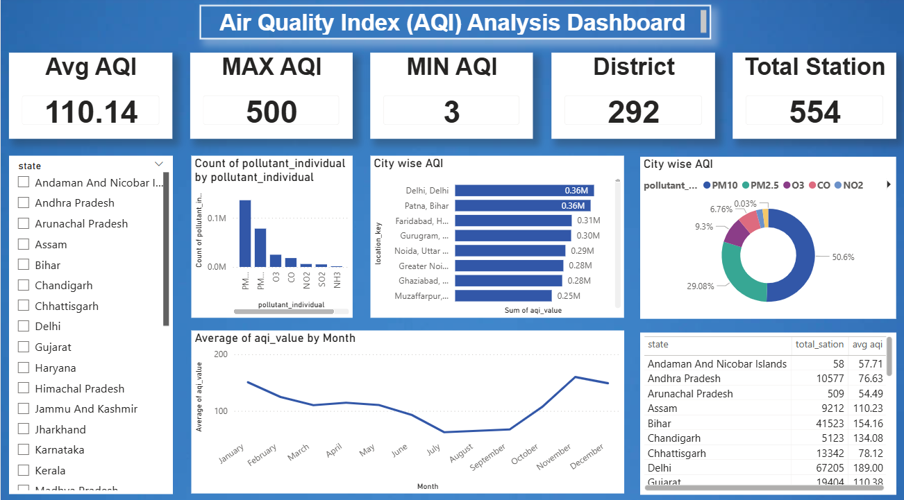

# India Air Quality Index (AQI) Analysis

🌫️ **India Air Quality Index (AQI) Analysis Project**

A complete data pipeline and analytics workspace for monitoring and analyzing air quality across India. This repository cleans and processes CPCB AQI data, enables SQL-based analytics, and includes a Power BI dashboard to visualize pollution trends, hotspots, and environmental risk metrics.

---

## Table of Contents

- [Project Overview](#project-overview)
- [Repository Structure](#repository-structure)
- [Data Schema](#data-schema)
- [Key Features](#key-features)
- [Getting Started](#getting-started)
  - [Prerequisites](#prerequisites)
  - [Setup](#setup)
  - [Usage](#usage)
- [SQL Analytics](#sql-analytics)
- [Dashboard](#dashboard)
- [Insights & Findings](#insights--findings)
- [Recommendations & Policy Implications](#recommendations--policy-implications)
- [Future Enhancements](#future-enhancements)
- [Data Sources & References](#data-sources--references)
- [Contributors](#contributors)
- [License](#license)
- [Contact](#contact)

---

## Project Overview

This project ingests raw air quality observations (AQI and pollutant readings) from Central Pollution Control Board (CPCB) sources, performs robust cleaning and processing, and produces datasets and analytics-ready views for exploratory analysis and visualization. The goal is to provide actionable insights for researchers, analysts, and policy makers to monitor air quality, identify hotspots, and design interventions.

Highlights:
- Cleaning pipeline for raw CPCB data (dates, geographic resolution, outliers)
- Advanced processing for pollutant-level analysis and temporal features
- 40+ SQL queries for standard and advanced analytics
- Power BI dashboard illustrating national and state-level trends

---

## Repository Structure

text
├── dataset/                    # Data files (raw, cleaned, processed)
├── clean_dataset.py            # Data cleaning and preprocessing script
├── processing.py               # Advanced data processing for analytics/Power BI
├── sql_queries.sql             # 40+ analytical SQL queries
├── aqi_power_bi_dashboard.pdf  # Dashboard visualization (export)
└── README.md                   # This file

---

## Data Schema

Core fields produced/used across the pipeline:

- `state` — State or union territory name
- `area` — City / district / monitoring area
- `location_key` — Unique key combining area and state for deduplication
- `date` — Observation date (datetime)
- `aqi_value` — Numerical AQI (0–500)
- `air_quality_status` — Categorical: Good, Satisfactory, Moderately Polluted, Poor, Very Poor, Severe
- `prominent_pollutants` — Original comma-separated list of prominent pollutants
- `pollutant_individual` — Exploded single pollutant entries (after processing)
- `number_of_monitoring_stations` — Station count for area (if available)
- Additional temporal fields: `year`, `month`, `day_of_week`, `is_weekend`

All numeric fields are validated to be within expected ranges (e.g., AQI 0–500). Geographic ambiguities are standardized (e.g., duplicate area names across different states).

---

## Key Features

- Robust cleaning:
  - Remove redundant/constant columns
  - Normalize date formats (DD-MM-YYYY → datetime)
  - Resolve ambiguous area/state names
  - Validate and filter AQI outliers

- Advanced processing:
  - Explode comma-separated `prominent_pollutants` into rows
  - Extract temporal features (year, month, weekday/weekend)
  - Categorize AQI into six severity levels
  - Aggregate for monthly/yearly and station-level time series

- Analytics:
  - 40+ SQL queries covering national/state/city statistics, trends, pollutant breakdowns, and risk assessments

- Visualization:
  - Power BI dashboard with national summary, state rankings, monthly trends, pollutant contributions, and hotspot maps

---

## Getting Started

### Prerequisites
- Python 3.8+
- pandas, numpy, python-dateutil (or see requirements)
- SQL client (Postgres/MySQL/SQLite) for running `sql_queries.sql`
- Power BI Desktop (for viewing/editing the dashboard PDF / .pbix if provided)

Install Python dependencies (example):
```bash
pip install pandas numpy python-dateutil
```

### Setup
1. Place the raw data CSV(s) into `dataset/raw/` (create directories if needed).
2. Inspect columns to ensure they match expected raw schema (date, state, area, aqi_value, prominent_pollutants, etc.).

### Usage

1. Clean raw data:
```bash
python clean_dataset.py
```
- Output: `dataset/cleaned/` (cleaned CSVs)

2. Process for analytics / Power BI:
```bash
python processing.py
```
- Output: `dataset/processed/` (exploded pollutant rows, aggregated time series, dimension tables)

3. Run SQL analytics:
- Import `sql_queries.sql` into your SQL client and run queries against the processed tables (or adapt table names to your database).

4. View dashboard:
- Open `aqi_power_bi_dashboard.pdf` for visual summaries and insights. If a `.pbix` is provided, open with Power BI Desktop for interactive exploration.

---

## SQL Analytics

`sql_queries.sql` contains curated queries including:
- National and state-level averages, minimums, maximums
- Counting monitoring stations and coverage gaps
- Monthly and seasonal trend analyses
- Pollutant frequency and contribution to poor AQI days
- Moving averages, volatility measures, and correlations
- Risk metrics: cumulative "bad" days per district/state

Use these queries to populate Power BI datasets or to run exploratory analysis in your database.

---

## Dashboard


The Power BI dashboard displays:
- National average AQI, top polluted states & cities
- Time-series charts (monthly & yearly)
- Heatmaps / choropleths for state and district-level AQI
- Pollutant contribution charts and frequency tables
- Alerts and threshold visualizations for emergency planning

Key metric examples (from processed sample data):
- National average AQI: ~110 (Moderate)
- MAX AQI: 500 (Severe), MIN AQI: 3 (Excellent)
- Coverage: 292 districts across 554 stations (sample)

---

## Insights & Findings

Summary of analytical highlights (from processed dataset):
- Delhi reports the highest average AQI (~189) and many severe days
- PM2.5 is the most common prominent pollutant (appears in >60% of records)
- Weekdays register ~15–20% higher pollution than weekends in industrial regions
- December and January exhibit the worst seasonal peaks nationally
- 30+ cities recorded zero "Good" air quality days in the analyzed period

Regional patterns:
- Northern plains: persistent severe pollution (AQI 250–500)
- Coastal and southern regions: moderate pollution with seasonal spikes
- North-East: relatively clean air (AQI 50–100)

---

## Recommendations & Policy Implications

Short-term:
- Real-time emergency alerts for AQI > 400
- Target control measures on top 5 pollutants regionally
- Public advisories for sensitive groups during peak months

Medium-to-long-term:
- Expand monitoring network to data-sparse districts
- Green corridors and stricter emission controls in top polluted cities
- Promote EVs and cleaner industrial fuel switches
- Agricultural policy changes to reduce post-harvest burning

---

## Future Enhancements

- Real-time CPCB / State monitoring API integration
- ML models for AQI forecasting and source apportionment
- Health impact dashboard linking hospital admissions & AQI
- Mobile app for personalized exposure alerts
- Advanced dispersion and source apportionment studies

---

## Data Sources & References

- Central Pollution Control Board (CPCB), India — primary monitoring data
- National Air Quality Index (NAQI) guidelines
- WHO Global Air Quality Guidelines
- Methodological references: US EPA AirNow adapted approaches

Please respect CPCB data usage policies when reusing raw data.

---

## Contributors

- Data collection: CPCB & State Pollution Control Boards
- Analysis: Environmental Data Science Community
- Visualization: Power BI Developer Community
- Public health context & validation: ICMR & domain experts

If you contributed to this project and would like to be listed, please open an issue or submit a PR.

---

## License

This project is intended for educational and research purposes. Data usage must comply with CPCB's data sharing policies. For commercial or policy applications, consult relevant authorities before deployment.

---

## Contact

For questions, issues, or collaboration requests:
- Open an issue in this repository
- Or contact the maintainers / contributors via the repository's contact information

Thank you for using the India AQI Analysis project — together we can make air cleaner and healthier for all.
